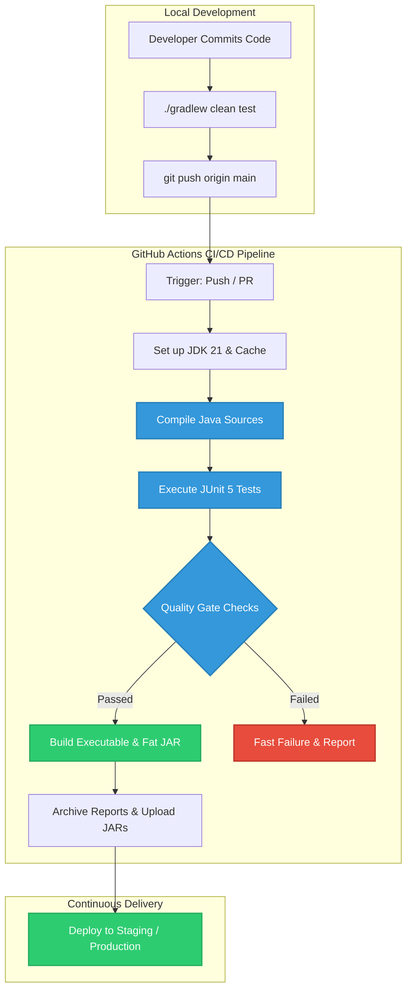

# Java Application DevOps Pipeline with Gradle

[](https://github.com/organization/java-gradle-devops-app/actions/workflows/ci-cd-pipeline.yml)
[](https://github.com/organization/java-gradle-devops-app)
[](https://adoptium.net/)
[](https://gradle.org)
[](https://junit.org/junit5/)
[](LICENSE)

A production-ready Java backend application and automated DevOps lifecycle pipeline built with **Gradle**, **JUnit 5**, and **GitHub Actions**. This repository demonstrates automated builds, continuous integration and delivery (CI/CD), quality gates, dependency management, and standalone executable packaging.

---

## 📌 Architecture & Lifecycle Flow



---

## 📂 Project Directory Structure

```text
java-gradle-devops-app/
│
├── .github/
│   └── workflows/
│       └── ci-cd-pipeline.yml          # GitHub Actions CI/CD pipeline definition
│
├── gradle/
│   └── wrapper/
│       ├── gradle-wrapper.jar          # Gradle wrapper binary
│       └── gradle-wrapper.properties   # Wrapper configuration (Gradle 8.8)
│
├── src/
│   ├── main/
│   │   ├── java/com/app/
│   │   │   ├── Application.java               # Application entry point
│   │   │   ├── config/AppConfig.java          # Configuration provider
│   │   │   ├── model/
│   │   │   │   ├── BuildReport.java           # Pipeline report data model
│   │   │   │   └── PipelineStatus.java        # Execution status enumeration
│   │   │   └── service/
│   │   │       ├── DevOpsPipelineService.java # Pipeline orchestrator
│   │   │       └── MetricsCalculator.java     # Metrics & quality gate evaluator
│   │   └── resources/
│   │       ├── application.properties         # Runtime configuration
│   │       └── logback.xml                    # Logging layout & logback setup
│   │
│   └── test/
│       ├── java/com/app/
│       │   ├── ApplicationTest.java                   # Application integration test
│       │   └── service/
│       │       ├── DevOpsPipelineServiceTest.java     # Service unit tests
│       │       └── MetricsCalculatorTest.java         # Parameterized & unit tests
│       └── resources/
│           └── test-config.properties                 # Test-specific properties
│
├── .gitignore                          # Standard git ignore configuration
├── build.gradle                        # Main Gradle build & dependency script
├── gradlew                             # Unix build script
├── gradlew.bat                         # Windows build script
├── settings.gradle                     # Gradle project settings
└── README.md                           # Developer documentation (DX)
```

---

## 🚀 Getting Started

### Prerequisites
- **JDK 17** or **JDK 21** installed (e.g. Eclipse Temurin or OpenJDK)
- **Git** version 2.20+

> [!NOTE]
> Gradle does not need to be pre-installed on your system. The repository includes the **Gradle Wrapper** (`./gradlew` or `gradlew.bat`), ensuring identical build results across all platforms.

---

## 🛠️ Gradle Build Commands

| Task | Command (Linux / macOS) | Command (Windows) | Description |
| :--- | :--- | :--- | :--- |
| **Clean** | `./gradlew clean` | `gradlew.bat clean` | Cleans the `build/` output directory |
| **Compile** | `./gradlew compileJava` | `gradlew.bat compileJava` | Compiles main Java source files |
| **Test** | `./gradlew test` | `gradlew.bat test` | Runs JUnit 5 test suite and creates reports |
| **Run** | `./gradlew run` | `gradlew.bat run` | Executes the application directly |
| **Package JAR** | `./gradlew jar` | `gradlew.bat jar` | Packages standard application JAR with Manifest |
| **Package Fat JAR** | `./gradlew fatJar` | `gradlew.bat fatJar` | Generates self-contained standalone executable JAR |
| **Full Build** | `./gradlew build` | `gradlew.bat build` | Compiles, tests, checks, and packages the app |

---

## 🧪 Testing & Quality Gates

The test suite leverages **JUnit 5 (Jupiter)**:
- **Unit Testing**: Tests domain logic in `DevOpsPipelineService` and `MetricsCalculator`.
- **Parameterized Testing**: Data-driven test execution covering edge cases in quality gates.
- **Integration Testing**: Verifies full application initialization and pipeline execution.

### Viewing Test Reports
After executing `./gradlew test`, open the HTML report in your browser:
```bash
# Path to report:
build/reports/tests/test/index.html
```

---

## 🔄 CI/CD Pipeline Breakdown

The CI/CD pipeline configured in [`.github/workflows/ci-cd-pipeline.yml`](.github/workflows/ci-cd-pipeline.yml) enforces the following stages:

1. **Triggering**: Automatic triggers on `push` and `pull_request` targeting `main` or `master`.
2. **Environment Setup**: Provisions **JDK 21 (Eclipse Temurin)** with built-in dependency caching.
3. **Execution**:
   - Compiles code with warning/error highlighting.
   - Executes all JUnit 5 test suites.
   - Assembles both thin and fat executable JARs.
4. **Artifact Archiving**:
   - Publishes HTML test reports for debugging.
   - Uploads compiled `.jar` files with 14-day retention.
5. **Continuous Delivery**: Prepares staging deployment upon successful `main` branch merges.

---

## 📋 Quality Gate Parameters

| Parameter | Default Value | Config Key |
| :--- | :--- | :--- |
| **Minimum Code Coverage** | `80.0%` | `pipeline.qualityGate.minCodeCoverage` |
| **Max Build Duration** | `120 seconds` | `pipeline.qualityGate.maxBuildDurationSeconds` |
| **Zero Test Failures** | `Enforced` | Evaluated on all test tasks |
| **Auto Deploy Enabled** | `true` | `pipeline.autoDeploy.enabled` |

---

## 📄 License
Distributed under the Apache 2.0 License.
